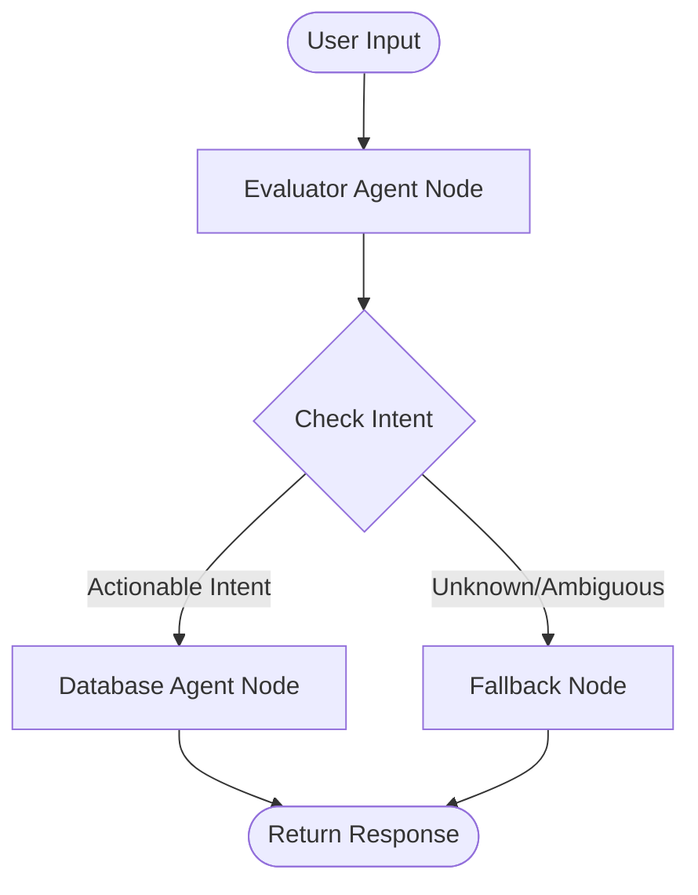

# 🤖 Recruiting Database Agent (RecruitAI)

A bilingual (Tamil, English, and code-mixed) **Recruiting Database Agent** built using **LangGraph**, **LangChain**, and **FastAPI**. The agent uses a Groq-powered LLM (`llama-3.3-70b-versatile`) to understand natural language queries, extract candidate search parameters, and safely query/update a database using parameterized SQL.

---

## 🛠️ Tech Stack

The system is built with a modern, lightweight, and resilient stack:
- **Orchestration**: [LangGraph](https://github.com/langchain-ai/langgraph) & [LangChain](https://github.com/langchain-ai/langchain) (StateGraph-based workflow engine)
- **Large Language Model**: [Groq API](https://groq.com/) (using `llama-3.3-70b-versatile` for high-accuracy intent classification and entity parsing)
- **REST API & Server**: [FastAPI](https://fastapi.tiangolo.com/) & [Uvicorn](https://www.uvicorn.org/)
- **Databases**: 
  - **Primary**: [MySQL](https://www.mysql.com/) (using connection pooling via `mysql-connector-python`)
  - **Automatic Fallback**: [SQLite](https://www.sqlite.org/) (an in-memory fallback seeded automatically with ~100 records if MySQL is offline)
- **Frontend UI**: Vanilla HTML5, CSS3, and JavaScript (integrated chat dashboard at `/`)
- **Validation**: [Pydantic v2](https://docs.pydantic.dev/) for request/response schemas

---

## 🧭 How the Agent Works

The agent uses a stateful architecture managed by LangGraph. The workflow operates as follows:



### 1. The State Object
All nodes communicate using a shared, typed dictionary state called [RecruitState](file:///s:/mySQL-Agent/recruiting_db_agent/utils/state.py#L4-L34), which maintains:
- `user_input`: The original natural language query.
- `intent`: Classified intent (`db_select` | `db_insert` | `db_update` | `unknown`).
- `entities`: Extracted parameters (e.g. candidate name, role, skills, experience, status).
- `db_query`: The exact parameterized SQL query generated.
- `db_result`: Returned database rows.
- `response`: The final message formatted for the user.
- `trace` / `errors`: Chronological logs and exception info for developer visibility.

### 2. The Nodes
- **[evaluator_node](file:///s:/mySQL-Agent/recruiting_db_agent/agents/evaluator_agent.py#L37-L105)**:
  Uses the Groq LLM with a system prompt ([prompts.py](file:///s:/mySQL-Agent/recruiting_db_agent/utils/prompts.py)) containing natural language rules for Tamil and English. It returns intent classification and extracts entities into a JSON structure.
- **[database_agent_node](file:///s:/mySQL-Agent/recruiting_db_agent/agents/database_agent.py#L80-L276)**:
  Takes the extracted entities, dynamically constructs parameterized SQL statements, executes them safely, and formats the query results into a polished list.
- **[fallback_node](file:///s:/mySQL-Agent/recruiting_db_agent/graph.py#L55-L64)**:
  Triggered when the query isn't recruiting-related. It returns a helpful prompt teaching the user how to talk to the agent.

---

## 🔒 Security Contract
The database agent is designed with a strict security model to prevent vulnerabilities:
1. **Zero SQL Injection**: User input is never concatenated into SQL strings. All queries are strictly parameterized.
2. **Explicit Column Selection**: The agent never runs `SELECT *`. It only requests columns whitelisted in [whitelist.py](file:///s:/mySQL-Agent/recruiting_db_agent/db/whitelist.py#L18-L46) to avoid leaking sensitive fields (e.g. salaries or passwords).
3. **No DELETES Allowed**: The [ALLOWED_OPERATIONS](file:///s:/mySQL-Agent/recruiting_db_agent/db/whitelist.py#L53-L57) whitelist maps allowed verbs (`SELECT`, `INSERT`, `UPDATE`) to specific tables. `DELETE` operations are completely disabled.

---

## 📁 Repository Structure

- [recruiting_db_agent/](file:///s:/mySQL-Agent/recruiting_db_agent): Core project directory
  - [main.py](file:///s:/mySQL-Agent/recruiting_db_agent/main.py): Test script that runs 5 sample queries locally.
  - [graph.py](file:///s:/mySQL-Agent/recruiting_db_agent/graph.py): Defines the LangGraph workflow structure.
  - [requirements.txt](file:///s:/mySQL-Agent/recruiting_db_agent/requirements.txt): List of python packages required.
  - [agents/](file:///s:/mySQL-Agent/recruiting_db_agent/agents): Agent implementations
    - [database_agent.py](file:///s:/mySQL-Agent/recruiting_db_agent/agents/database_agent.py): Query building, sorting (screening candidates first), and response formatting.
    - [evaluator_agent.py](file:///s:/mySQL-Agent/recruiting_db_agent/agents/evaluator_agent.py): LLM intent classification and entity parser.
  - [api/](file:///s:/mySQL-Agent/recruiting_db_agent/api): FastAPI web routes
    - [routes.py](file:///s:/mySQL-Agent/recruiting_db_agent/api/routes.py): App declaration, endpoints (`/ask`, `/stats`, `/health`, `/candidates`, `/search`).
  - [db/](file:///s:/mySQL-Agent/recruiting_db_agent/db): Database connector and schema
    - [connector.py](file:///s:/mySQL-Agent/recruiting_db_agent/db/connector.py): [DBConnector](file:///s:/mySQL-Agent/recruiting_db_agent/db/connector.py#L137-L249) that manages MySQL connections & SQLite in-memory fallback.
    - [schema.sql](file:///s:/mySQL-Agent/recruiting_db_agent/db/schema.sql): Database schema and initial seeds (candidates, jobs, call_logs).
    - [whitelist.py](file:///s:/mySQL-Agent/recruiting_db_agent/db/whitelist.py): Whitelisted columns and query operations.
  - [static/](file:///s:/mySQL-Agent/recruiting_db_agent/static): Web UI client assets
    - [index.html](file:///s:/mySQL-Agent/recruiting_db_agent/static/index.html): Interactive chatbot user interface.
  - [utils/](file:///s:/mySQL-Agent/recruiting_db_agent/utils): Utility helper modules
    - [prompts.py](file:///s:/mySQL-Agent/recruiting_db_agent/utils/prompts.py): Evaluator prompt with language guidelines and examples.
    - [state.py](file:///s:/mySQL-Agent/recruiting_db_agent/utils/state.py): Shared state models.

---

## 🚀 How to Run the Project

### 1. Install Dependencies
Ensure you have Python 3.10+ installed. Install the required packages:
```bash
pip install -r recruiting_db_agent/requirements.txt
```

### 2. Configure Environment Variables
Create or update the `.env` file in the [recruiting_db_agent/](file:///s:/mySQL-Agent/recruiting_db_agent) directory with your credentials:
```env
GROQ_API_KEY=your_groq_api_key_here
DB_HOST=localhost
DB_PORT=3306
DB_USER=mas_agent
DB_PASSWORD=your_mysql_password_here
DB_NAME=recruiting_mas
```

### 3. Database Setup (Optional)
If you have a local MySQL instance:
1. Create the database:
   ```sql
   CREATE DATABASE recruiting_mas;
   ```
2. Initialize tables and seed mock data:
   ```bash
   mysql -u mas_agent -p recruiting_mas < recruiting_db_agent/db/schema.sql
   ```

*Note: If MySQL is not running or your credentials are incorrect, the agent will gracefully switch to the **SQLite Fallback mode** which builds and seeds an in-memory database automatically.*

### 4. Running the Code

#### Option A: Run the CLI Demo (5 Test Cases)
Run the script to verify that intent classification, translation, and entity extraction are functioning properly. It tests five pre-defined Tamil, English, and mixed-language queries:
```bash
cd recruiting_db_agent
python main.py
```

#### Option B: Run the FastAPI Web Server
Start the server backend to expose REST API endpoints and serve the UI:
```bash
cd recruiting_db_agent
python -m uvicorn api.routes:app --reload
```
Once started, open your browser and navigate to **`http://localhost:8000`** to interact with the RecruitAI Chat Interface.

---

## 💬 Sample User Queries

You can ask the agent questions in English, Tamil, or mixed Tamil-English (code-switched):

- **English Queries**:
  - *"Find all Full Stack Developer candidates"*
  - *"Show Data Scientists with more than 3 years experience"*
  - *"Update Kiran Patel status to interview"*
  - *"Add new candidate Arjun Kumar"*
- **Tamil / Tamil-English (தமிழ்) Queries**:
  - *"எனக்கு full stack developers வேணும்"* (Needs role extraction)
  - *"Priya Sharma status interview க்கு மாத்து"* (Triggers a status update)
  - *"3 years experience உள்ள candidates காட்டு"* (Extracts experience criteria)
  - *"எனக்கு இன்னிக்கு backend developers வேணும்"* (Mixed language select)
